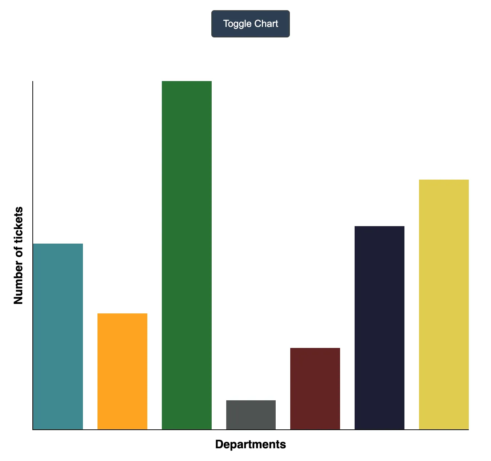
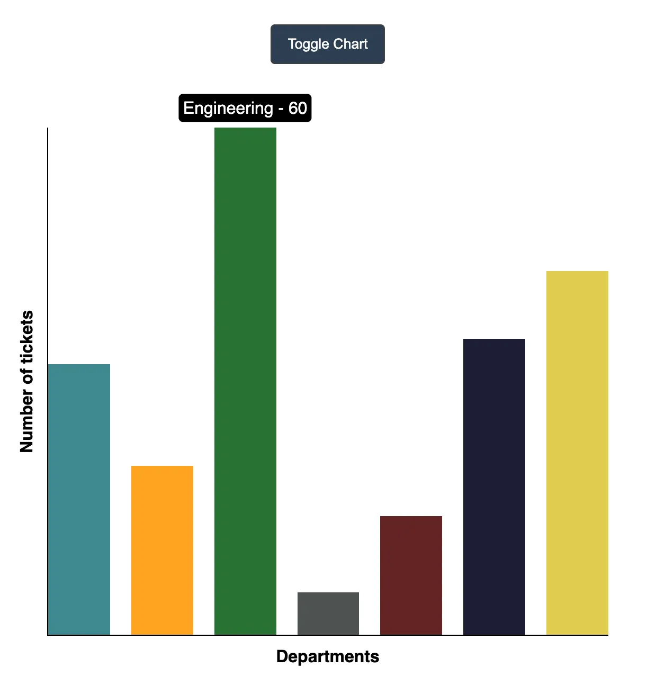

To build an interactive JIRA-style velocity bar chart in React, we need to use a combination of React state management and libraries like CSS or a charting library such as `chart.js` or `d3.js` for rendering the chart. Below is a structured approach with code to meet the requirements.

### Functional Requirements:

1. **Toggle Visibility:** The chart should be visible or hidden by clicking a button.
2. **Bar Chart Rendering:** The Y-axis represents the number of tickets, and the X-axis represents departments. Each bar should be scaled according to the maximum number of tickets.
3. **Tooltips:** Each bar will display a tooltip with the department name and the number of tickets when hovered.
4. **Animations:** Bars should animate from height 0 to their final value on entry/exit.

### Mockup Example

