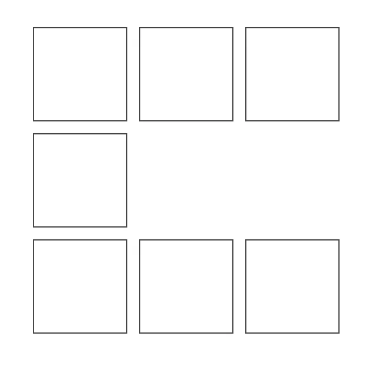
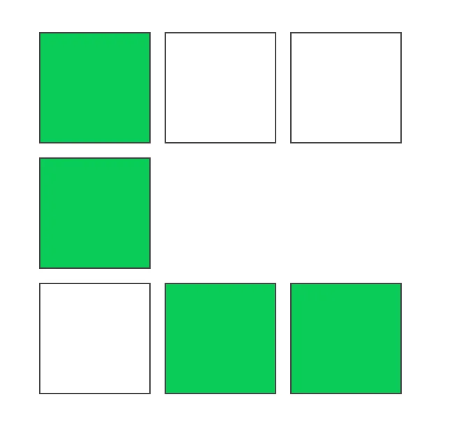

# Shape Creation from 2D Array (Frontend Coding Round)

## Problem Statement

You are given a 2D array, where each `1` in the array represents an empty box to be created as part of a shape. The user can interact with the boxes by selecting them, which changes their background color. Once all boxes are selected, they will auto-deselect based on the order of selection. During deselection, the interaction with the boxes should be disabled.

## Functional Requirements

1. **Empty Box Creation:** Create empty boxes where the array value is `1`.
2. **Box Selection:** When a box is selected, its background color should change to `#0bcc59`.
3. **Auto-deselection:** Once all boxes are selected, auto-deselect the boxes in the same order they were selected.
4. **Non-interruptible Deselection:** During deselection, user interactions should be disabled, and the process should be non-interruptible.

## Example Mockup

1. **Shape with Empty Boxes:**
   

1. **Shape with some filled boxes:**
   
